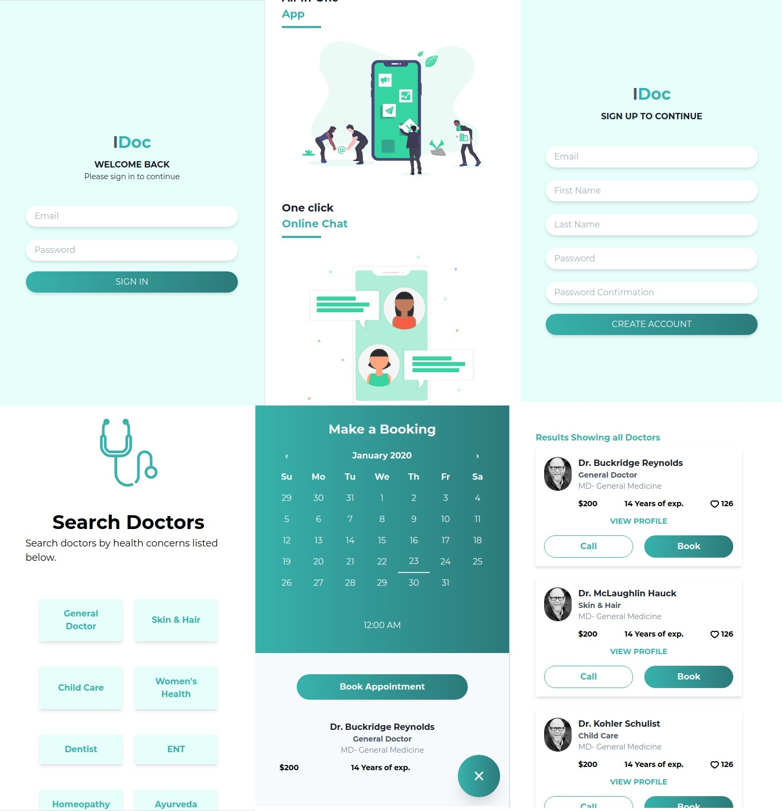

# Edoc-API 



Check out [front end](https://github.com/mosaaleb/edoc)

## Introduction
This is the backend of the capstone project in [Microverse](https://www.microverse.org/) curriculum
The project handles searching physicians by their specialty and handles creating appointments with patients.

It serves frontend React application

react app: [edoc](https://github.com/mosaaleb/edoc/)

**Features**
- Mobile app.
- Authentication with JWT.
- Filtering physicians by category.
- Creating appointments with physicians.
- Leaving upvotes and reviews.

## Built With
- Rails 6.0.2
- Rspec

### Prerequisites
- ruby 2.6.3
- bundle

### Setup
```
git clone git@github.com:mosaaleb/edoc-api.git
cd edoc
rails db:create db:migrate db:seed
```

### Running the project
- Clone the [front end](https://github.com/mosaaleb/edoc).
- Follow the instruction on how to set up the frontend.
- Setup the back end part (check the Setup section).
- Start the server on both the backend and frontend.
```ruby
# back end Rails
rails s
# front end react
npm start
```
- Start developing.

### Testing
The app is fully tested with `1:1.2` Code to Test Ratio
You can run all unit tests with:
`rspec`

## Author

- [Github](https://github.com/mosaaleb)
- [Linkedin](https://www.linkedin.com/in/muhammadebeid/)
- [muhammed.ebeid@gmail.com](muhammed.ebeid@gmail.com)

## Coming Features:
- [ ] Doctor profile page endpoint

**Having a specific feature in mind?** 
Please [Submit](https://github.com/mosaaleb/edoc-api/labels/enhancement) it


## 🤝 Contributing
Contributions, issues, and feature requests are welcome!

Feel free to check the [issues page](issues/).


## 📝 License
This project is [MIT](lic.url) licensed.
